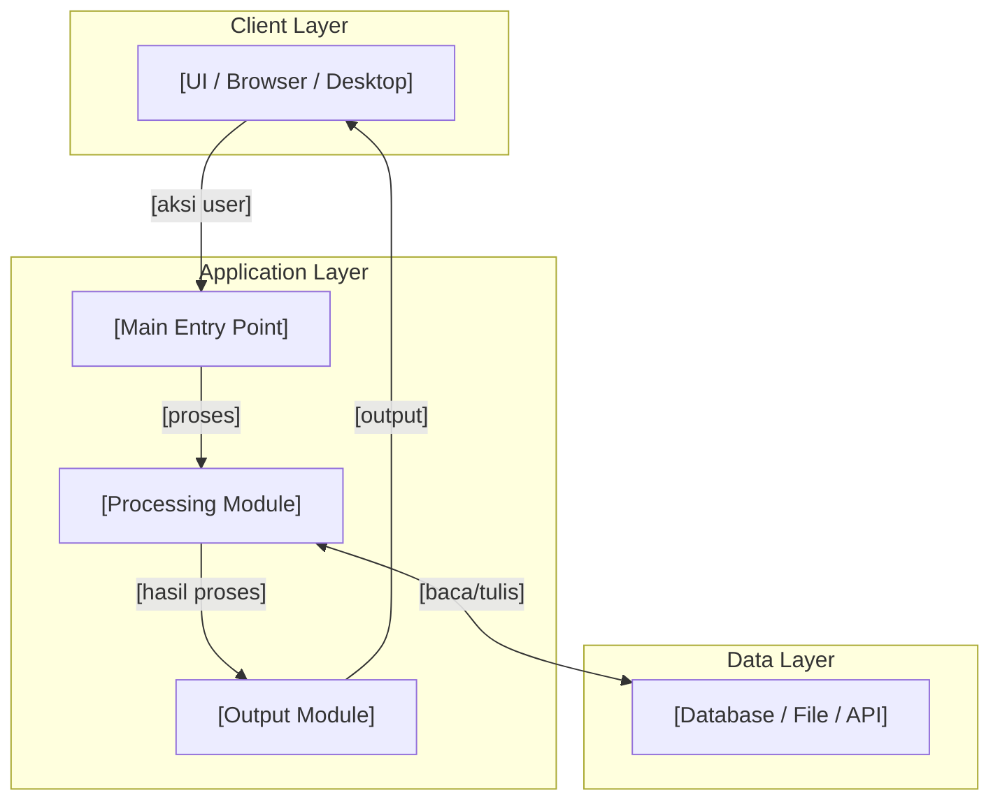
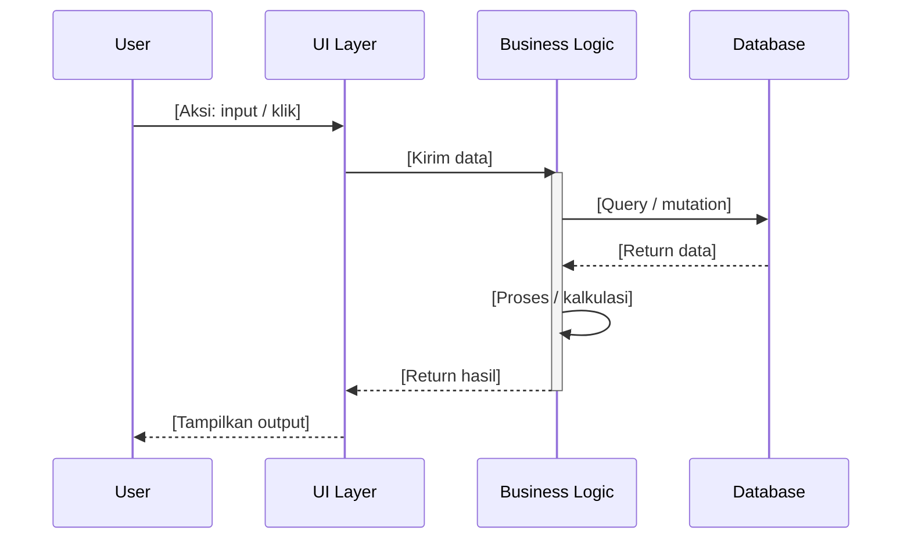
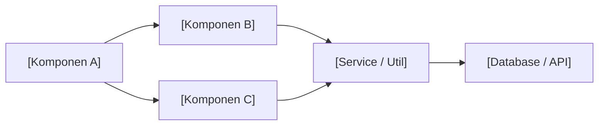

# MASTER CONTEXT — [NAMA APLIKASI] v1.0

**Proyek:** [Nama Project Lengkap]  
**Tim:** [Nama Tim / Divisi / Organisasi]  
**Versi Dokumen:** 1.0 (dibuat [TANGGAL])  
**Repository:** [URL GitHub / GitLab]  
**Tujuan Dokumen:** Master context project untuk GitHub Copilot & developer.  
Baca seluruh dokumen ini sebelum menulis satu baris kode pun.

---

## DAFTAR ISI

1. [Latar Belakang & Business Problem](#1-latar-belakang--business-problem)
2. [Arsitektur Aplikasi](#2-arsitektur-aplikasi)
3. [Skema Data & Struktur Database](#3-skema-data--struktur-database)
4. [Business Logic & Rules](#4-business-logic--rules)
5. [Spesifikasi UI / Output](#5-spesifikasi-ui--output)
6. [Design System & Tokens](#6-design-system--tokens)
7. [Contoh Data / Sample Input-Output](#7-contoh-data--sample-input-output)
8. [Rules & Edge Cases](#8-rules--edge-cases)
9. [Catatan Teknis & Debugging](#9-catatan-teknis--debugging)
10. [Development Phases & Changelog](#10-development-phases--changelog)
11. [Instruksi Khusus untuk GitHub Copilot](#11-instruksi-khusus-untuk-github-copilot)
12. [Konvensi Kode](#12-konvensi-kode)
13. [Deployment & Environment](#13-deployment--environment)
14. [Testing Strategy](#14-testing-strategy)
15. [Troubleshooting & Known Issues](#15-troubleshooting--known-issues)
16. [Security Considerations](#16-security-considerations)
17. [Roadmap & Future Enhancements](#17-roadmap--future-enhancements)
18. [FAQ & Glossary](#18-faq--glossary)
19. [Architecture Diagrams](#19-architecture-diagrams)

---

## 1. LATAR BELAKANG & BUSINESS PROBLEM

### Konteks Organisasi / Latar Belakang
[Jelaskan siapa organisasinya, apa konteksnya, mengapa project ini ada.
Tulis seperti menjelaskan ke orang baru yang sama sekali tidak tahu apa-apa.]

Contoh:
> Tim [X] berada di bawah [divisi Y]. Setiap [periode], tim ini melakukan
> [proses Z] yang selama ini dilakukan secara manual menggunakan [tool lama].

### Problem Statement
> "[Tulis problem utama dalam satu kalimat pertanyaan atau pernyataan.
> Ini adalah kalimat yang paling sering ditanyakan stakeholder.]"

Selama ini:
- [Pain point 1: apa yang menyulitkan sekarang?]
- [Pain point 2]
- [Pain point 3]

### Tujuan Aplikasi
Membangun [jenis aplikasi: web app / desktop GUI / API / dashboard] yang:
1. [Tujuan 1 — terukur dan konkret]
2. [Tujuan 2]
3. [Tujuan 3]
4. [Tujuan 4]

### Success Criteria
Aplikasi dianggap berhasil jika:
- [ ] [Kriteria 1: misal "User bisa generate laporan dalam < 30 detik"]
- [ ] [Kriteria 2]
- [ ] [Kriteria 3]

---

## 2. ARSITEKTUR APLIKASI

### Stack Teknologi

| Komponen | Teknologi | Versi | Keterangan |
|---|---|---|---|
| Runtime / Framework | [Next.js / Python / Express] | [versi] | [kenapa dipilih] |
| Language | [TypeScript / JavaScript / Python] | [versi] | |
| Database | [Supabase / PostgreSQL / SQLite] | [versi] | |
| Auth | [Supabase Auth / Clerk / NextAuth] | [versi] | |
| Styling | [Tailwind / MUI / shadcn] | [versi] | |
| [Komponen lain] | [Teknologi] | [versi] | |

### Struktur Folder

```
nama-project/
├── [folder utama]/
│   ├── [file 1]          # [penjelasan singkat]
│   ├── [file 2]          # [penjelasan singkat]
│   └── [subfolder]/
│       ├── [file]        # [penjelasan singkat]
│       └── [file]        # [penjelasan singkat]
├── [folder kedua]/
│   └── ...
├── docs/
│   └── MASTER_CONTEXT.md  # File ini
├── .vscode/
│   └── mcp.json           # Konfigurasi MCP agents
├── .github/
│   └── copilot-instructions.md
├── .env.example
├── README.md
└── [file config lain]
```

### Alur Data (Data Flow)

```
[Gambar alur data menggunakan ASCII art atau teks terstruktur]

Contoh:
┌─────────────────┐
│   USER INPUT    │
│  [Form / File]  │
└────────┬────────┘
         │
         ▼
┌─────────────────┐
│  PROCESSING     │
│  [Logic/Parser] │
└────────┬────────┘
         │
         ▼
┌─────────────────┐
│   DATABASE      │
│  [Simpan data]  │
└────────┬────────┘
         │
         ▼
┌─────────────────┐
│   OUTPUT        │
│  [UI / Export]  │
└─────────────────┘
```

---

## 3. SKEMA DATA & STRUKTUR DATABASE

### 3.1 [Nama Tabel / Entitas 1]

**Sumber data:** [dari mana data ini berasal]  
**Keterangan:** [penjelasan singkat apa yang disimpan]

| Kolom / Field | Tipe | Keterangan | Contoh |
|---|---|---|---|
| `id` | UUID / INT | Primary key | `uuid-xxx` |
| `[field_1]` | [tipe] | [keterangan] | [contoh] |
| `[field_2]` | [tipe] | [keterangan] | [contoh] |
| `created_at` | TIMESTAMP | Waktu dibuat | `2026-01-01 08:00` |

**Join key / relasi:** [field apa yang jadi kunci relasi ke tabel lain]

### 3.2 [Nama Tabel / Entitas 2]

[Ulangi format yang sama]

### 3.3 Perbedaan Antar Sumber Data (jika relevan)

> Dokumentasikan di sini jika ada dua sumber data serupa tapi berbeda
> format — ini mencegah bug yang sering terjadi karena asumsi yang salah.

| Aspek | [Sumber A] | [Sumber B] |
|---|---|---|
| [Nama kolom kunci] | `[nama di A]` | `[nama di B]` |
| [Aspek lain] | [nilai A] | [nilai B] |

---

## 4. BUSINESS LOGIC & RULES

> ⚠️ Bagian ini adalah yang PALING PENTING untuk dibaca AI.
> Tanpa ini, AI akan menebak-nebak logika bisnis.

### 4.1 [Nama Proses / Kalkulasi Utama]

```
[Tulis formula atau algoritma dalam pseudocode atau bahasa natural yang jelas]

Contoh:
pct_realisasi = (realisasi_total / alokasi) × 100

Klasifikasi:
- pct > 100%  → OVER_BUDGET  (merah, warning keras)
- pct >= 80%  → TEPAT_SASARAN (hijau)
- pct >= 40%  → PERLU_PERHATIAN (kuning)
- pct > 0%    → KRITIS (merah)
- pct = 0%    → BELUM_TEREALISASI (abu)
```

### 4.2 [Aturan Bisnis 2]

[Jelaskan aturan, kondisi, dan exception-nya]

### 4.3 Validasi Data

| Kondisi | Aksi yang Diambil |
|---|---|
| [Input kosong / null] | [Bagaimana handle-nya] |
| [Data duplikat] | [Bagaimana handle-nya] |
| [Nilai negatif / tidak wajar] | [Bagaimana handle-nya] |
| [Format salah] | [Bagaimana handle-nya] |

---

## 5. SPESIFIKASI UI / OUTPUT

### 5.1 Halaman / View Utama

**[Nama halaman/view 1]**
- URL / Route: `[path]`
- Tujuan: [apa yang ditampilkan]
- Komponen utama: [list komponen]
- Data yang ditampilkan: [dari tabel/endpoint mana]

**[Nama halaman/view 2]**
[ulangi format]

### 5.2 Komponen Kritis

> Dokumentasikan komponen yang memiliki behavior kompleks atau
> ketergantungan data yang tidak obvious.

**[Nama Komponen]:**
- Props yang wajib: `[propName]: [tipe]`
- Behavior: [jelaskan interaksi]
- Edge case: [apa yang terjadi jika data kosong / error]

### 5.3 State Management

[Jelaskan bagaimana state dikelola: local state, global store, server state, dll]

---

## 6. DESIGN SYSTEM & TOKENS

### Warna

```css
/* Primary */
--color-primary: [hex];       /* [kapan dipakai] */
--color-secondary: [hex];     /* [kapan dipakai] */

/* Status */
--color-success: [hex];
--color-warning: [hex];
--color-danger: [hex];
--color-info: [hex];

/* Neutral */
--color-bg-primary: [hex];
--color-bg-secondary: [hex];
--color-text-primary: [hex];
--color-text-secondary: [hex];
--color-border: [hex];
```

### Typography

```css
--font-family: '[nama font]', sans-serif;
--font-size-base: 14px;
--font-size-sm: 12px;
--font-size-lg: 16px;
--font-size-xl: 20px;
--font-weight-normal: 400;
--font-weight-bold: 500;
```

### Spacing & Layout

```css
--spacing-xs: 4px;
--spacing-sm: 8px;
--spacing-md: 16px;
--spacing-lg: 24px;
--spacing-xl: 32px;
--border-radius-sm: 4px;
--border-radius-md: 8px;
--border-radius-lg: 12px;
```

---

## 7. CONTOH DATA / SAMPLE INPUT-OUTPUT

> Dokumentasikan contoh data nyata (dengan data dummy jika sensitif).
> Ini membantu AI generate kode yang sesuai dengan shape data asli.

### Sample Input

```json
{
  "[field_1]": "[contoh nilai]",
  "[field_2]": [contoh_angka],
  "[nested_object]": {
    "[sub_field]": "[contoh]"
  }
}
```

### Sample Output

```json
{
  "[hasil_1]": "[contoh output]",
  "[kalkulasi]": [angka_hasil],
  "[status]": "[TEPAT_SASARAN / dll]"
}
```

### Contoh Edge Case

```json
// Kasus: data null
{ "[field_1]": null, "[field_2]": 0 }
// Expected behavior: [apa yang seharusnya terjadi]

// Kasus: nilai ekstrem
{ "[field_1]": 999999999, "[field_2]": 0.001 }
// Expected behavior: [apa yang seharusnya terjadi]
```

---

## 8. RULES & EDGE CASES

> ⚠️ Dokumentasikan semua kasus sudut yang pernah ditemukan.
> Ini adalah memori kolektif project — jangan sampai bug yang sama muncul dua kali.

| # | Kasus | Expected Behavior | Status |
|---|---|---|---|
| 1 | [Deskripsi edge case] | [Apa yang harus terjadi] | [Sudah handle / TODO] |
| 2 | [Deskripsi edge case] | [Apa yang harus terjadi] | [Sudah handle / TODO] |
| 3 | Data duplikat pada [field] | Ambil yang terbaru berdasarkan `updated_at` | Sudah handle |

---

## 9. CATATAN TEKNIS & DEBUGGING

> Dokumentasikan semua hal teknis yang tidak obvious — keputusan
> aneh, workaround, dan "jebakan" yang sudah pernah dihadapi.

### Keputusan Teknis & Alasannya

| Keputusan | Alternatif yang Ditolak | Alasan |
|---|---|---|
| [Pakai X bukan Y] | [Y] | [Kenapa X lebih baik untuk kasus ini] |
| [Implementasi Z dengan cara A] | [Cara B] | [Alasan teknis] |

### Jebakan yang Sudah Pernah Terjadi

```
⚠️ JEBAKAN 1: [Nama masalah]
   Gejala: [error message atau behavior aneh]
   Root cause: [kenapa terjadi]
   Fix: [solusinya]
   Jangan ulangi dengan: [cara preventif]

⚠️ JEBAKAN 2: [Nama masalah]
   [format sama]
```

---

## 10. DEVELOPMENT PHASES & CHANGELOG

### Fase Development

| Fase | Scope | Status | Target |
|---|---|---|---|
| Phase 1 | [Fitur inti minimal] | [Done / In Progress / TODO] | [Tanggal] |
| Phase 2 | [Fitur tambahan] | [Status] | [Tanggal] |
| Phase 3 | [Optimasi / Nice-to-have] | [Status] | [Tanggal] |

### Changelog

#### v1.0.0 — [Tanggal]
- Initial release
- [Fitur yang ada di versi ini]

#### v1.1.0 — [Tanggal]
- [Perubahan]
- [Fix]

---

## 11. INSTRUKSI KHUSUS UNTUK GITHUB COPILOT

> Bagian ini dibaca AI setiap sesi. Tulis instruksi yang spesifik,
> tegas, dan tidak ambigu.

### Wajib Dilakukan Setiap Kali

1. Baca `docs/MASTER_CONTEXT.md` sebelum menulis kode apapun
2. Gunakan `use context7` untuk semua task yang menyebut nama library
3. Gunakan `#sequential-thinking` untuk debugging dan perancangan arsitektur
4. Selalu referensi #file yang relevan daripada mendeskripsikan isinya

### Larangan Keras

- ❌ Jangan ubah [file/fungsi kritis] tanpa konfirmasi eksplisit
- ❌ Jangan pakai `[pattern yang dilarang]`, selalu pakai `[alternatif]`
- ❌ Jangan hardcode nilai [X] — ambil dari environment variable
- ❌ Jangan commit tanpa menjalankan [test / lint / audit] terlebih dahulu
- ❌ Jangan asumsikan nama kolom sama antara [sumber A dan B] — cek bagian 3.3

### Cara Menambah Fitur Baru

1. Baca bagian yang relevan di MASTER_CONTEXT ini
2. Identifikasi file mana yang perlu diubah (jangan buat file baru sembarangan)
3. Pastikan ikuti konvensi di bagian 12
4. Update bagian changelog di MASTER_CONTEXT ini setelah selesai

### Pattern yang Selalu Dipakai

```
[Contoh: Semua data fetching pakai Server Component]
[Contoh: Semua form pakai Server Action, bukan API route]
[Contoh: Error handling selalu pakai try-catch dengan logging]
```

---

## 12. KONVENSI KODE

### Naming

```
Files     : kebab-case         (user-profile.tsx, parse-data.py)
Components: PascalCase         (UserProfile, DataTable)
Functions : camelCase          (getUserById, parseExcelData)
Constants : SCREAMING_SNAKE    (MAX_RETRY_COUNT, API_BASE_URL)
Types/Int : PascalCase         (UserProfile, ApiResponse)
Variables : camelCase          (userData, totalAmount)
```

### Struktur File Komponen

```typescript
// 1. Imports (external dulu, internal kemudian)
// 2. Types & interfaces
// 3. Constants
// 4. Component / function utama
// 5. Helper functions
// 6. Export default
```

### Error Handling

```typescript
// Selalu gunakan pattern ini untuk async operations:
try {
  const result = await [operation]
  return { data: result, error: null }
} catch (error) {
  console.error('[NamaFungsi]:', error)
  return { data: null, error: error.message }
}
```

### Komentar

```
// Wajib komentar untuk:
// - Business logic yang tidak obvious
// - Workaround dan alasannya
// - TODO dengan konteks yang jelas: // TODO(hanif): [apa yang perlu dilakukan dan kenapa]

// TIDAK perlu komentar untuk:
// - Kode yang self-explanatory
// - Komentar yang hanya repeat nama fungsi
```

---

## 13. DEPLOYMENT & ENVIRONMENT

### Environment Variables

```bash
# Wajib ada di semua environment
[NAMA_VAR_1]=[contoh_nilai]       # [keterangan]
[NAMA_VAR_2]=[contoh_nilai]       # [keterangan]

# Hanya production
[PROD_ONLY_VAR]=[contoh]          # [keterangan]

# Hanya development/testing  
[DEV_ONLY_VAR]=[contoh]           # [keterangan]
```

### Setup Lokal (Langkah-per-langkah)

```bash
# 1. Clone
git clone [URL_REPO]
cd [nama-folder]

# 2. Install dependencies
[npm install / pip install -r requirements.txt]

# 3. Setup environment
cp .env.example .env
# Edit .env dan isi semua variable

# 4. Setup database (jika ada)
[perintah migrasi / seed]

# 5. Jalankan
[npm run dev / python app.py]
```

### Deployment

| Environment | Platform | Branch | URL |
|---|---|---|---|
| Development | Lokal | `main` / `develop` | `localhost:3000` |
| Staging | [Vercel / Railway / dll] | `staging` | [URL] |
| Production | [Platform] | `main` | [URL] |

---

## 14. TESTING STRATEGY

### Apa yang Harus Di-test

| Layer | Yang Ditest | Tool |
|---|---|---|
| Unit | [Fungsi kalkulasi, utils, helpers] | [Vitest / Jest / pytest] |
| Integration | [API endpoints, DB queries] | [Testing Library / httpx] |
| E2E | [User flows kritis] | [Playwright] |

### Test Cases Wajib

- [ ] [Test case 1: deskripsi singkat + expected outcome]
- [ ] [Test case 2]
- [ ] Happy path untuk setiap fitur utama
- [ ] Error handling: apa yang terjadi saat input tidak valid
- [ ] Edge case dari bagian 8

---

## 15. TROUBLESHOOTING & KNOWN ISSUES

| Issue | Gejala | Solusi | Status |
|---|---|---|---|
| [Nama issue] | [Error message / behavior] | [Cara fix] | [Fixed / Known Bug] |
| [Nama issue] | [Gejala] | [Solusi] | [Status] |

---

## 16. SECURITY CONSIDERATIONS

### Data Sensitif

- [Sebutkan field/data yang sensitif dan bagaimana di-handle]
- [Contoh: password di-hash dengan bcrypt, jangan pernah log plaintext]

### Access Control

- [Siapa yang boleh akses apa]
- [Row Level Security policy jika pakai Supabase]
- [Role-based access control jika ada]

### Checklist Sebelum Deploy

- [ ] Semua secret ada di environment variable, tidak hardcoded
- [ ] Semua input user divalidasi server-side
- [ ] Rate limiting aktif di endpoint sensitif
- [ ] CORS hanya allow domain yang diizinkan
- [ ] console.log yang berisi data sensitif sudah dihapus
- [ ] Dependencies sudah di-audit (`npm audit` / `pip-audit`)

---

## 17. ROADMAP & FUTURE ENHANCEMENTS

### Prioritas Tinggi (Next Sprint)

- [ ] [Feature / improvement]
- [ ] [Feature / improvement]

### Prioritas Sedang (Bulan Depan)

- [ ] [Feature]

### Nice-to-Have (Suatu Saat)

- [ ] [Feature]

---

## 18. FAQ & GLOSSARY

### FAQ

**Q: [Pertanyaan yang sering ditanyakan developer baru]**  
A: [Jawaban]

**Q: [Pertanyaan teknis yang tidak obvious]**  
A: [Jawaban dengan detail yang cukup]

### Glossary

| Term | Definisi |
|---|---|
| [Istilah domain-spesifik] | [Penjelasan] |
| [Singkatan / akronim] | [Kepanjangan dan artinya] |

---

## 19. ARCHITECTURE DIAGRAMS

### 19.1 System Overview



### 19.2 Data Flow Detail



### 19.3 Entity Relationship Diagram

```mermaid
erDiagram
    [ENTITAS_1] ||--o{ [ENTITAS_2] : "relasi"
    [ENTITAS_2] ||--o{ [ENTITAS_3] : "relasi"
    
    [ENTITAS_1] {
        uuid id PK
        string nama
        timestamp created_at
    }
    
    [ENTITAS_2] {
        uuid id PK
        uuid entitas1_id FK
        string [field]
        decimal [angka]
    }
```

### 19.4 Component / Module Dependency



---

**Dokumen ini adalah Referensi Master Context untuk [Nama Project].**

**Author:** [Nama / Tim]  
**Status:** [Draft / Active / Deprecated]  
**Terakhir Diperbarui:** [Tanggal] oleh [Siapa]  
**Repository:** [URL]  

> 💡 **Cara update dokumen ini:** Setiap kali ada perubahan arsitektur,
> business rule baru, atau edge case ditemukan — update MASTER_CONTEXT
> di bagian yang relevan dan bump versi dokumen di header.

